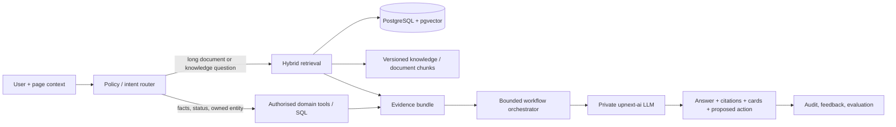

# Kế hoạch sản phẩm và kỹ thuật: UpNext AI Assistant có grounding/RAG

> Trạng thái: đề xuất để Product, Engineering, Privacy/Security và vận hành cùng review. Chưa phải uỷ quyền triển khai production.
>
> Phạm vi: **chỉ Candidate Career Assistant**. Nhà tuyển dụng tiếp tục dùng các workflow AI chuyên biệt hiện có; Recruiter Chatbot không nằm trong roadmap này. Tài liệu này thay thế cách nghĩ “đặt một chatbot ở mọi trang”.

## 1. Quyết định điều hành

UpNext không nên làm một chatbot hỏi gì cũng trả lời. Giá trị thật là giúp người dùng **ra quyết định hoặc hoàn tất một việc tuyển dụng** nhanh hơn, trên dữ liệu có quyền truy cập và có bằng chứng.

| Đối tượng | Quyết định | Lý do |
| --- | --- | --- |
| Ứng viên | Làm **Candidate Career Assistant**. | Nhu cầu lặp lại, tần suất cao: hiểu CV, chọn việc, theo dõi đơn, chuẩn bị ứng tuyển/phỏng vấn. Dữ liệu chủ yếu là của chính người dùng nên rủi ro quyền truy cập thấp hơn. |
| Nhà tuyển dụng | **Không làm Recruiter Chatbot.** Giữ và cải tiến workflow AI chuyên biệt: tạo/import JD, salary insight, CV Screening; Talent Discovery là roadmap riêng có consent/masking. | Chat tổng quát làm phân tán roadmap, khó đo ROI, tăng chi phí và mở rộng bề mặt rủi ro lộ CV/candidate. Mỗi workflow hiện có đã có entry point, quyền và kết quả nghiệp vụ rõ hơn chat. |
| RAG | Bắt buộc cho tri thức dài/tài liệu và truy vấn semantic; không dùng RAG một cách hình thức cho dữ liệu entity nhỏ đã có API chuẩn. | Đọc toàn bộ CV, JD, knowledge base vào prompt vừa tốn tiền vừa dễ hallucinate; nhưng gọi DB tool cho “trạng thái đơn của tôi” chính xác hơn vector search. |
| Agentic | Dùng **workflow có giới hạn**, không dùng autonomous agent. | Hệ thống tuyển dụng có quyền riêng tư, quota và tác động nghiệp vụ; agent không được tự mở rộng quyền, gửi tin, sửa dữ liệu hoặc chạy vòng lặp vô hạn. |

## 2. Bài toán cần giải, không phải danh sách tính năng AI

### 2.1 Ứng viên

Ứng viên không thiếu nơi để hỏi “viết CV thế nào”. Họ bị kẹt ở bốn thời điểm có ngữ cảnh riêng:

1. **Trước khi ứng tuyển:** “Job này có hợp với tôi không, còn thiếu gì, có nên apply không?”
2. **Trong khi chuẩn bị hồ sơ:** “CV hiện tại đang yếu ở đâu so với job này; sửa phần nào trước?”
3. **Sau khi ứng tuyển:** “Đơn nào cần theo dõi, tôi đang ở bước nào, nên chuẩn bị gì?”
4. **Chuẩn bị phỏng vấn:** “Dựa trên JD và CV của tôi, hãy tạo bài luyện tập và phản hồi có căn cứ.”

Kết quả mong muốn phải là một hành động rõ ràng: sửa CV section, lưu/apply job, xem job tương tự, chuẩn bị checklist, hoặc theo dõi application. Câu trả lời văn xuôi không dẫn đến hành động không được tính là thành công sản phẩm.

### 2.2. Vì sao không làm Recruiter Chatbot

Recruiter không cần thêm một cửa sổ chat để hỏi những việc hệ thống đã có workflow chuyên biệt. Giá trị tuyển dụng nằm ở các tác vụ có state và bằng chứng: tạo JD, benchmark lương, CV Screening, và Talent Discovery có consent. Các phần này phải tiếp tục được cải thiện **ngay trong job/application workspace**, không bị bọc lại bằng chat.

Điều này giúp tập trung đầu tư vào trải nghiệm candidate — nơi một assistant xuyên CV, job và application giải quyết nhiều bế tắc lặp lại — đồng thời tránh tạo một đường mới có thể lộ dữ liệu candidate hoặc khiến recruiter dựa vào câu trả lời khó audit.

## 3. Hiện trạng đã audit

Candidate Copilot hiện có không phải chat thuần: model router chọn tool, backend đọc profile/CV/đơn/job public đã phân quyền, rồi model stream phần diễn giải. Nó có quota, SSE, PII redaction, cards và confirmation cho hành động ghi dữ liệu.

Tuy nhiên nó **chưa phải RAG**:

- `search_matching_jobs` lấy pool job theo skills rồi rank bằng luật; không query vector index.
- CV được cắt một đoạn giới hạn và đưa trực tiếp vào context; không chunk/retrieve evidence phù hợp với câu hỏi.
- Không có knowledge corpus, source versioning, citation provenance, retrieval evaluation hoặc agent loop nhiều bước.
- Staging hiện chưa có extension `pgvector` và không có record `job_embeddings`/`cv_embeddings`. JSON-vector fallback chỉ là phương án tương thích của pipeline khác, không đủ để gọi là RAG production.

Điểm tái sử dụng tốt: private `upnext-ai` có authenticated LLM/embedding endpoints; backend đã có tool registry, quota ledger, SSE, PII redaction, embeddings model contract và CV Screening durable queue. Các điểm này là nền tảng, không phải lý do để bê nguyên flow cũ sang mọi use case.

## 4. Kiến trúc đích: grounding theo loại dữ liệu

Không có một “vector database cho tất cả”. Mỗi câu hỏi được đưa qua policy router, sau đó lấy dữ liệu từ nguồn phù hợp nhất.



### 4.1 Bốn đường grounding

| Loại câu hỏi | Nguồn đúng | Ví dụ | Không dùng |
| --- | --- | --- | --- |
| Fact có cấu trúc/quyền sở hữu | Tool SQL có authorization | trạng thái đơn, quota, job đang mở | Vector search, vì có thể stale/sai quyền |
| Một document dài | Chunk retrieval trong document đã được phép | “CV này có ví dụ leadership nào?” | Toàn bộ PDF/raw CV vào prompt |
| Corpus tri thức đã quản trị | Hybrid search keyword + vector + rerank | quy trình ứng tuyển, chính sách UpNext, hướng dẫn candidate | Web search tự do ở v1 |
| Semantic matching | Index theo entity và filter trước retrieval | job phù hợp candidate, candidate phù hợp job | LLM tự bịa score hoặc scan toàn DB |

### 4.2 Nguyên tắc dữ liệu

1. **Filter quyền/tenant trước vector search**, không retrieve xong mới lọc.
2. Chunk mang `visibility`, `owner/tenant`, `sourceVersion`, `consent`, `expiresAt`, `deletedAt`; tất cả là filter bắt buộc.
3. Không embedding raw email, phone, tên, địa chỉ, URL liên hệ, access token hoặc file CV gốc. Tạo `embeddingText` đã redaction/pseudonymization riêng.
4. Citation phải trỏ tới source/chunk id, tiêu đề, phiên bản và snippet đã redaction; không dùng “AI suy luận” làm citation.
5. Job/CV thay đổi, consent rút, job hết hạn hoặc document bị xoá phải làm index stale ngay và loại khỏi retrieval trước khi re-index hoàn tất.

## 5. Candidate Career Assistant v1

### 5.1 Use case được triển khai

| Use case | Grounding | Output phải hành động được | Success metric |
| --- | --- | --- | --- |
| Đánh giá fit với job đang xem | public job + own profile/CV chunks + deterministic rubric | match evidence, 3 gap ưu tiên, CTA lưu/apply/sửa CV | tỷ lệ apply/save sau insight; user rating |
| Cải thiện CV theo mục tiêu | own CV chunks + profile + selected job (nếu có) | patch theo section, evidence thiếu, user phải confirm trước khi ghi | tỷ lệ apply patch và CV completion |
| Tìm việc có giải thích | public job index + candidate preferences + structured hard filters | 3–10 job, lý do match/gap và freshness | save/apply rate, zero expired/unauthorised result |
| Theo dõi đơn và chuẩn bị bước tiếp | own application status + job + curated prep knowledge | timeline, checklist và CTA | giảm câu hỏi support / return rate |
| Hỏi kiến thức nghề nghiệp/UpNext | curated candidate knowledge corpus | câu trả lời có citations | grounded-answer rate, citation click rate |

### 5.2 Những việc không làm ở v1

- Không tự apply, tự gửi message, tự thay đổi CV/job preference hay tự hủy đơn.
- Không hứa khả năng đậu, không dự đoán đặc tính nhạy cảm hay xếp hạng “employability” chung chung.
- Không dùng web search live cho tư vấn nghề nghiệp; dữ liệu ngoài kiểm soát sẽ làm citation/chi phí/safety khó quản lý.
- Không giữ toàn bộ CV/message history trong prompt. Dùng summary đã kiểm soát + top chunks có evidence.

## 6. Ranh giới recruiter và dependency hiện có

Recruiter Chatbot bị loại khỏi kế hoạch này. Không tạo endpoint chat, knowledge corpus, quota hay UI chat mới cho recruiter.

Các dependency recruiter chỉ ảnh hưởng Candidate Assistant ở đúng hai điểm:

1. Candidate chỉ retrieve job đang public, approved, chưa hết hạn; không đọc draft hay dữ liệu nội bộ company.
2. Candidate không bao giờ dùng assistant để xem candidate khác, CV pool, contact hoặc kết quả CV Screening.

Các roadmap AI recruiter hiện có (AI Job Post, CV Screening, Talent Discovery) tiếp tục được quản lý và review trong tài liệu/PR riêng; không được gộp vào scope, KPI hoặc release gate của Candidate Assistant.

## 7. Bounded agentic workflow

Agentic chỉ hữu ích khi một tác vụ cần nhiều nguồn dữ liệu và lựa chọn bước tiếp theo. Nó phải là state machine do backend kiểm soát, không phải vòng lặp LLM tự do.

```text
REQUESTED → CLASSIFIED → RETRIEVING → EVIDENCE_VALIDATED → DRAFTED
        ↘ BLOCKED / NEEDS_CLARIFICATION / FAILED
REQUIRES_CONFIRMATION → EXECUTED | DECLINED | EXPIRED
```

Quy tắc bắt buộc:

1. Intent map sang allowlist tool/workflow trước khi model chạy; model không cấp quyền.
2. Tối đa 2 planning pass, 4 tool calls, 1 retrieval round và budget/timeout per run; không retry action write tự động.
3. Tool có JSON schema, authorization server-side, idempotency key, timeout và audit.
4. Mọi write (save job, CV patch, note, message draft send, status) tách **propose → human review → execute**. UI hiển thị diff và scope trước confirm.
5. Nếu evidence không đủ, trả “không đủ dữ liệu”/clarifying question; không lấp chỗ trống bằng suy đoán.
6. Prompt injection trong CV/JD/knowledge chunk bị xem là untrusted content: phân cách rõ với instruction, strip tool-like instructions, log rule hit; tool permission không bao giờ lấy từ retrieved text.

## 8. Data model và indexing

### 8.1 Bảng đề xuất

| Entity | Field cốt lõi |
| --- | --- |
| `knowledge_documents` | audience, locale, title, canonicalUrl, status, sourceVersion, owner/tenant nullable, publishedAt, expiresAt |
| `knowledge_chunks` | documentId, ordinal, contentRedacted, tokenCount, lexicalText, embedding, embeddingModel, checksum, visibility, metadata JSONB |
| `ai_retrieval_runs` | assistantRunId, queryHash, corpus, filtersHash, topK, rerankerVersion, latencyMs, resultCount, status |
| `ai_retrieval_results` | retrievalRunId, chunkId/entityRef, rank, lexicalScore, semanticScore, rerankScore, cited boolean |
| `ai_assistant_runs` | actorType, actorId, companyId nullable, workflow, policyVersion, promptVersion, model, status, token/cost/latency, traceId |
| `ai_action_proposals` | runId, actionType, payloadRedacted, preview, expiresAt, idempotencyKey, status, confirmedBy |
| `ai_evaluations` | runId, scenario/version, grounded, citationCorrect, actionUseful, safetyViolation, human label |

Raw original document remains in CV/file storage under current access policy. Chunks/index are derived data with their own deletion/revocation lifecycle; they are not a bypass copy of the document.

### 8.2 Vector storage

PostgreSQL + `pgvector` là lựa chọn v1 để giảm hệ thống vận hành. Điều kiện launch:

- image PostgreSQL staging/production có extension `vector` thật sự;
- migration fail-closed ở production profile nếu vector extension không có, thay vì silently “RAG bằng JSON fallback”;
- HNSW index theo corpus/filter phù hợp, reindex runbook và capacity test;
- lexical search (`tsvector`/`pg_trgm`) + semantic cosine + deterministic reranker, không chỉ nearest-neighbour;
- async index queue có idempotency, retry/dead-letter, `indexVersion`, checksum và metrics lag.

JSON cosine fallback chỉ được phép cho migration/backfill nhỏ hoặc emergency read-only; không là backend production của RAG corpus lớn.

## 9. Retrieval và answer contract

1. Normalize query; classify audience/workflow; resolve page context server-side.
2. Apply tenant/visibility/consent/status filters before search.
3. Retrieve top 30 hybrid candidates; rerank top 10; send tối đa 6 chunks/8k tokens evidence vào answer model.
4. Model phải trả structured answer gồm `claims`, `citationIds`, `uncertainty`, `suggestedActions`; backend reject citation id ngoài retrieved set.
5. Client chỉ render citations do backend resolved. Citation phải mở source hợp lệ hoặc highlight snippet; nếu source private thì chỉ owner đúng quyền thấy.
6. Khi không có relevant evidence: answer rõ giới hạn, gợi ý workflow/tool khác; không trả citation giả.

## 10. Privacy, fairness, safety và compliance

- Candidate data không dùng cho recruiter retrieval nếu không có consent/discovery eligibility. `OPEN_TO_WORK` không phải consent.
- Recruiter queries luôn bind company id, job/application assignment và permission; candidate card/CV luôn đi qua masking projection, không serialize raw entity.
- Không retrieve/embed/use để score các protected/sensitive attributes: ảnh, giới tính, tuổi/ngày sinh, địa chỉ chính xác, tình trạng sức khỏe, dân tộc/tôn giáo, email/SĐT/link cá nhân.
- AI output không tự reject, không tự hạ/xếp hạng hiring decision; screening/ranking chỉ là decision support có rubric/evidence/audit/human review.
- Encrypt data at rest/in transit theo nền tảng hiện có; internal service tokens scope hẹp, TTL ngắn; không log prompt/CV raw, secrets hoặc full retrieved chunks.
- Thiết lập retention riêng cho prompts, summaries, retrieval traces, chunks, feedback; hỗ trợ delete/revoke/backfill purge theo candidate/company/document.
- Legal/Privacy phải review consent text, processor/model provider, transfer/retention trước production. Kế hoạch này không thay thế tư vấn pháp lý.

## 11. UX và minh bạch

1. Không dùng một ô chat vô ngữ cảnh làm UI chính. Entry point gắn với Job, CV, Application hoặc Hiring pipeline và có quick actions tương ứng.
2. Hiện “đang dùng dữ liệu nào” ở mức dễ hiểu: CV hiện tại, job đang xem, các nguồn hướng dẫn; không lộ internal prompt/tool name.
3. Hiện citation, thời điểm dữ liệu và phân biệt “dữ kiện từ UpNext” với “gợi ý AI”.
4. Action card luôn preview/diff, confirm/cancel và undo nếu nghiệp vụ hỗ trợ.
5. Có feedback theo claim/action (“không đúng”, “nguồn không liên quan”, “hữu ích”), report safety và fallback không-AI để người dùng vẫn hoàn tất việc.
6. Quota hiển thị trước lượt gọi; thất bại/time-out hoàn quota idempotent và không để message trạng thái streaming dang dở.

## 12. Model, cost và reliability

- Router/intent: model fast + structured output, temperature thấp.
- Rerank/deterministic rubric trước; model quality chỉ dùng để tổng hợp câu trả lời có evidence.
- Cache theo content/query/filter/policy version; không cache xuyên user/company khi context private.
- Per workflow: token cap, retrieval cap, tool timeout, total timeout, daily/org budget và circuit breaker provider.
- Private `upnext-ai` là gateway model; backend giữ policy, authorization, business tools, quota và persistence. Provider không được kết nối database nghiệp vụ trực tiếp.
- Log theo trace id: workflow, model, latency, cost estimate, retrieved ids (không raw content), tool outcomes, safety block và action result.

## 13. Evaluation trước khi launch

Không rollout dựa vào demo. Xây eval set versioned, được redaction, gồm tiếng Việt/Anh và các tình huống đối kháng.

| Nhóm | Tiêu chí release |
| --- | --- |
| Retrieval | Recall@10/grounded context đạt ngưỡng do Product đặt; không trả document ngoài quyền; stale/deleted source = 0 result |
| Grounded answer | claim có citation hợp lệ; citation support đúng claim; hallucination critical = 0 trong eval set |
| Action | payload/diff đúng; write không xảy ra trước confirm; idempotency/retry không duplicate |
| Privacy/security | cross-tenant retrieval = 0; PII leak test = 0; prompt injection không mở rộng tool scope |
| Utility | human raters đánh giá answer/action đủ dùng; task success tốt hơn flow không AI |
| Reliability | p95 latency, timeout/error, cost/run nằm trong SLO/budget; quota refund chính xác |

Thêm online canary: 5–10% opt-in, kill switch theo workflow, dashboard theo role/plan/model/prompt version. Không lấy thumbs-up đơn lẻ làm chỉ số chất lượng.

## 14. Lộ trình triển khai và release gates

### Phase 0 — Candidate discovery và controls (1–2 tuần)

- Phỏng vấn 10–15 candidate theo task thật; chọn 3 candidate workflows bằng tần suất × pain × measurable outcome.
- Chốt data classification, consent, retention, policy/action matrix, pricing hypothesis và success metrics.
- Viết eval scenarios trước code; nhận sign-off Product, Privacy/Security, Engineering.

**Gate:** không có workflow/action/metric rõ ràng thì không build generic chat.

### Phase 1 — Retrieval platform (2–3 tuần)

- Sửa infra PostgreSQL để `pgvector` là capability verified; thêm startup/deploy preflight và staging backfill plan.
- Tạo document/chunk/index/retrieval/audit models và async indexing queue.
- Xây curated candidate knowledge corpus nhỏ, source-owned/versioned; hybrid retrieval, filters, citations and test harness.

**Gate:** vector extension/index thật, zero unauthorized retrieval trong integration tests, evaluation baseline đạt.

### Phase 2 — Candidate Assistant grounded beta (2–3 tuần)

- Launch job-fit, CV evidence/rewrite, application next step, knowledge Q&A với context-first UI.
- Integrate retrieval contract into current Copilot while giữ tool workflow cho facts/actions.
- Add feedback, dashboards, canary/kill switch, quota and refund verification.

**Gate:** grounded-answer and task-success threshold đạt; no P0 privacy/safety issue; cost nằm trong budget.

### Phase 3 — Candidate Assistant expanded beta (2–3 tuần)

- Mở rộng các workflow candidate đã đạt metric: CV patch có diff/confirm, job-search explanation và preparation kit theo job đã chọn.
- Cải thiện retrieval freshness, long-document chunking, conversation summary và feedback-to-evaluation loop; không tăng quyền hành động tự động.

**Gate:** candidate task-success và grounded-answer threshold duy trì khi tải/corpus tăng; no P0 privacy/safety issue.

### Phase 4 — Bounded candidate workflows (sau beta)

- Chỉ thêm multi-step workflow nơi single tool/RAG không đủ, ví dụ “tạo interview kit từ selected job + CV của chính candidate + rubric”.
- Implement plan state, tool receipts, action proposal/approval, replay tests and per-step budget.

**Gate:** mỗi tool/action có owner, audit/retry/rollback story; không có autonomous high-impact action.

## 15. Ownership

| Area | Owner | Deliverable |
| --- | --- | --- |
| Product/research | Product lead | candidate workflow priority, JTBD, pricing, success metrics |
| Backend | Backend team | policy engine, tools, retrieval/audit/action contracts, queues |
| AI service | AI team | provider gateway, embeddings, structured/stream interfaces, model observability |
| Frontend | Frontend team | context-first assistant UX, citations, diff/confirm, feedback/fallback |
| Infra/SRE | Infra team | pgvector capability, secret/network policy, deploy preflight, dashboards/alerts |
| Privacy/Security | designated reviewer | consent, data mapping, retention, red-team sign-off |
| QA | QA + Product | eval dataset, E2E acceptance, regression and canary checks |

## 16. Acceptance criteria khi tuyên bố “AI Assistant hoàn thiện”

Chỉ được tuyên bố hoàn thiện một workflow khi đồng thời có:

1. Một job-to-be-done, owner, user-facing boundary và measurable outcome.
2. Grounding source có authorization, lifecycle, freshness và citation contract rõ ràng.
3. E2E staging test với dữ liệu test; retry/cancel/quota refund/action confirmation đều pass.
4. Automated unit, integration, cross-tenant, prompt-injection, PII-redaction và retrieval evaluation tests pass.
5. Dashboard/alert/kill switch/runbook, cost budget và audit trace hoạt động.
6. Privacy/Security sign-off cho dữ liệu candidate, consent/masking policy và retention được test.
7. Canary đủ dữ liệu đạt quality/utility/cost thresholds trước khi mở rộng.

## 17. Việc không nên làm ngay

- Đổi tên Copilot thành “Agentic RAG” khi chưa có corpus/index/citation evaluation.
- Đưa toàn bộ CV/JD/history vào prompt để giả lập retrieval.
- Dùng embeddings từ raw CV để tìm candidate toàn hệ thống.
- Dùng agent tự do có quyền write hoặc gửi outreach.
- Bán unlimited chat trước khi có cost guardrail, cache, quota và eval.
- Mở lại đề xuất Recruiter Chatbot chỉ vì Candidate Copilot đã có UI; đó là một quyết định sản phẩm mới, cần tài liệu và sign-off riêng.

Kết quả cần hướng tới không phải nhiều tin nhắn AI hơn; là thời gian ra quyết định ngắn hơn, hành động đúng hơn, và dữ liệu candidate/company được giữ đúng quyền.
