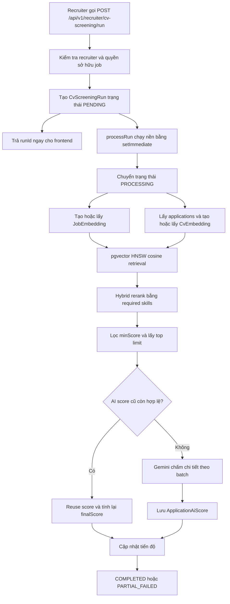

# Luồng lọc CV bằng AI, Gemini và pgvector

Tài liệu này là nguồn mô tả chuẩn cho tính năng CV Screening của UpNext backend. Nội dung bám theo code hiện tại, từ lúc recruiter khởi tạo một phiên lọc, tạo embedding, tìm kiếm HNSW bằng pgvector, hybrid reranking, chấm chi tiết bằng Gemini, lưu kết quả, cho tới cách frontend polling và hiển thị.

## 1. Mục tiêu và phạm vi

Tính năng dùng để xếp hạng các ứng viên đã nộp CV vào một job post cụ thể. Pipeline có ba tầng:

1. **Semantic retrieval:** dùng embedding để tìm CV gần yêu cầu công việc về mặt ngữ nghĩa.
2. **Structured skill reranking:** kiểm tra độ phủ kỹ năng bắt buộc và số năm kinh nghiệm từ dữ liệu có cấu trúc.
3. **AI detailed scoring:** Gemini đọc bằng chứng trong CV và chấm kỹ năng, kinh nghiệm, dự án, học vấn.

Kết quả cuối cùng được lưu theo application và sắp xếp giảm dần theo `finalScore`.

Tính năng chỉ xử lý các application đã tồn tại. Nó không tự tìm ứng viên ngoài danh sách đã ứng tuyển và không tự thay đổi trạng thái tuyển dụng của application.

## 2. Công nghệ và cấu hình hiện tại

| Thành phần               | Giá trị hiện tại                                   |
| ------------------------ | -------------------------------------------------- |
| Backend                  | NestJS + Prisma + PostgreSQL                       |
| Vector database          | PostgreSQL extension `pgvector`                    |
| PostgreSQL Docker image  | `pgvector/pgvector:0.8.5-pg17`                     |
| Embedding model          | `gemini-embedding-001`                             |
| Số chiều embedding       | 768                                                |
| Embedding cache key      | `gemini-embedding-001:768:l2-v1`                   |
| Vector distance          | Cosine distance, toán tử `<=>`                     |
| Approximate index        | HNSW                                               |
| HNSW query setting       | `ef_search = 160`, `iterative_scan = strict_order` |
| AI scoring model         | `gemini-2.5-flash`                                 |
| Scoring version          | `cv-screening-v5-pgvector-hybrid-vi`               |
| Embedding concurrency    | 8                                                  |
| Gemini batch size        | 8 CV/request                                       |
| Gemini batch concurrency | 1                                                  |
| Default detailed limit   | 100                                                |
| Maximum detailed limit   | 200                                                |

## 3. Kiến trúc tổng thể



`POST /run` là API bất đồng bộ. Response chỉ xác nhận đã tạo phiên chạy. Frontend phải dùng `runId` để polling trạng thái.

## 4. Các file chính

| File                                                                          | Trách nhiệm                                                                         |
| ----------------------------------------------------------------------------- | ----------------------------------------------------------------------------------- |
| `src/modules/cv-screening/cv-screening.controller.ts`                         | Khai báo API recruiter cho CV screening.                                            |
| `src/modules/cv-screening/cv-screening.service.ts`                            | Điều phối run, retrieval, cache AI score, Gemini scoring và lưu kết quả.            |
| `src/modules/cv-screening/embedding.service.ts`                               | Build text, gọi Gemini embedding, chuẩn hóa vector, lưu pgvector và hybrid ranking. |
| `src/modules/cv-screening/gemini-scoring.service.ts`                          | Prompt, response schema, retry và chuẩn hóa điểm Gemini.                            |
| `src/modules/cv-screening/dto/run-cv-screening.dto.ts`                        | Validate request chạy screening.                                                    |
| `prisma/schema.prisma`                                                        | Schema run, embeddings và AI scores.                                                |
| `prisma/migrations/20260715100000_enable_pgvector_cv_screening/migration.sql` | Bật pgvector, thêm vector columns, HNSW indexes và hybrid score columns.            |
| `docker-compose.yml`                                                          | Cấu hình PostgreSQL có pgvector.                                                    |
| `src/common/config/env.validation.ts`                                         | Đọc `GEMINI_API_KEY` và các biến môi trường.                                        |

## 5. Điều kiện dữ liệu đầu vào

Một run cần:

- Recruiter đã đăng nhập và thuộc một company.
- Job post tồn tại và thuộc đúng company của recruiter.
- Application liên kết tới `candidateProfileId` và `cvVersionId` hợp lệ.
- CV version có `parsedText`, hoặc candidate profile có đủ dữ liệu để tổng hợp text.
- Server có `GEMINI_API_KEY` hợp lệ.
- PostgreSQL đã bật extension `vector` và chạy migration pgvector.

Nếu job chưa có application, run vẫn có thể hoàn tất nhưng kết quả là mảng rỗng.

## 6. Authentication, authorization và versioning

Toàn bộ API screening yêu cầu:

```http
Authorization: Bearer <recruiter-access-token>
```

Guard bắt buộc actor là `RECRUITER`.

Backend dùng URI versioning với version mặc định `1`, vì vậy route đúng có prefix:

```txt
/api/v1
```

Service luôn kiểm tra company ownership:

- Recruiter phải có `companyId`.
- `jobPost.companyId` phải bằng company của recruiter.
- Run phải thuộc company của recruiter.
- Application phải thuộc một job của company đó.

## 7. API contract

### 7.1. Khởi tạo một screening run

```http
POST /api/v1/recruiter/cv-screening/run
```

Request:

```json
{
  "jobPostId": "8e10280c-ae2d-4579-a048-c25279447a3e",
  "limit": 100,
  "minScore": 50
}
```

| Field       | Bắt buộc | Validation     | Ý nghĩa                                               |
| ----------- | -------- | -------------- | ----------------------------------------------------- |
| `jobPostId` | Có       | UUID           | Job cần lọc CV.                                       |
| `limit`     | Không    | Integer, 1-200 | Số CV tối đa được Gemini chấm chi tiết. Mặc định 100. |
| `minScore`  | Không    | Number, 0-100  | Điểm `retrievalScore` tối thiểu để vào vòng Gemini.   |

`minScore` không còn là semantic score thuần. Đây là ngưỡng của điểm hybrid retrieval.

Response:

```json
{
  "runId": "9c12b224-8d60-4d58-a9f8-0ae5fc74b0f4",
  "status": "PENDING"
}
```

### 7.2. Lấy trạng thái run

```http
GET /api/v1/recruiter/cv-screening/runs/:runId
```

Response mẫu:

```json
{
  "id": "9c12b224-8d60-4d58-a9f8-0ae5fc74b0f4",
  "jobPostId": "8e10280c-ae2d-4579-a048-c25279447a3e",
  "companyId": "cab584b0-f147-474c-aef8-b529215e6ac7",
  "recruiterAccountId": "d90b9eaf-40ee-49e6-a86e-89a898fb7230",
  "totalApplications": 180,
  "processedCount": 64,
  "failedCount": 1,
  "limit": 100,
  "minScore": 50,
  "status": "PROCESSING",
  "errorMessage": null,
  "startedAt": "2026-07-15T10:00:01.000Z",
  "finishedAt": null,
  "createdAt": "2026-07-15T10:00:00.000Z",
  "updatedAt": "2026-07-15T10:00:20.000Z"
}
```

`processedCount` là số CV trong nhóm detailed scoring đã được xử lý hoặc reuse, không phải số embedding đã scan. Do `limit` và `minScore`, giá trị này có thể nhỏ hơn `totalApplications` ngay cả khi run đã hoàn tất.

### 7.3. Lấy danh sách kết quả

```http
GET /api/v1/recruiter/cv-screening/runs/:runId/results
```

Kết quả được sort theo `finalScore DESC`.

```json
[
  {
    "applicationId": "0dcf9539-df15-4e25-ad08-460ed663e585",
    "candidateName": "Nguyễn Văn A",
    "jobTitle": "Senior Java Backend Engineer",
    "finalScore": 84.3,
    "semanticScore": 79,
    "skillMatchScore": 92,
    "retrievalScore": 80.95,
    "aiScore": 85.74,
    "skillScore": 35,
    "experienceScore": 27,
    "projectScore": 16,
    "educationScore": 7.74,
    "matchedSkills": ["Java", "Spring Boot", "PostgreSQL"],
    "missingSkills": ["Kafka"],
    "summary": "Ứng viên có nền tảng backend phù hợp và kinh nghiệm thực tế tốt.",
    "recommendation": "Phù hợp",
    "cvFileUrl": "/api/v1/recruiter/applications/0dcf9539-df15-4e25-ad08-460ed663e585/cv"
  }
]
```

### 7.4. Lấy điểm chi tiết của một application

```http
GET /api/v1/recruiter/applications/:applicationId/ai-score
```

Ngoài các điểm cơ bản, response có thêm:

- `strengths`
- `weaknesses`
- `modelName`
- `scoringVersion`
- Thông tin run gần nhất
- `createdAt`, `updatedAt`

### 7.5. Xem file CV gốc

```http
GET /api/v1/recruiter/applications/:applicationId/cv
```

Backend trả file theo kiểu inline với `Content-Type` và `Content-Disposition` phù hợp.

Lưu ý hiện tại: fallback `cvFileUrl` được build trong service không chứa `/v1`. Frontend nên ưu tiên URL public của file nếu có; nếu tự dựng route fallback thì phải dùng endpoint versioned `/api/v1/recruiter/applications/:applicationId/cv`.

## 8. Vòng đời của một screening run

| Status API       | Giá trị trong database | Ý nghĩa                                         |
| ---------------- | ---------------------- | ----------------------------------------------- |
| `PENDING`        | `pending`              | Run vừa được tạo, chưa bắt đầu xử lý.           |
| `PROCESSING`     | `processing`           | Đang embedding, retrieval hoặc AI scoring.      |
| `COMPLETED`      | `completed`            | Pipeline hoàn tất và không ghi nhận lỗi.        |
| `PARTIAL_FAILED` | `partial_failed`       | Có kết quả nhưng một phần CV hoặc batch bị lỗi. |
| `FAILED`         | `failed`               | Run lỗi và không tạo được kết quả hữu ích.      |

Luồng trạng thái thông thường:

```txt
PENDING -> PROCESSING -> COMPLETED
                      -> PARTIAL_FAILED
                      -> FAILED
```

## 9. Build embedding text cho job

`EmbeddingService.getOrCreateJobEmbedding()` lấy job cùng:

- Category
- Employment type
- Experience level
- Education level
- Working days
- Description
- Requirements
- Benefits
- Skills, priority, minimum years, proficiency
- Specializations
- Locations và working model

Text đại diện có cấu trúc:

```txt
Job title: ...
Category: ...
Employment type: ...
Experience level: ...
Education level: ...
Working days: ...
Description: ...
Requirements: ...
Benefits: ...
Required skills: ...
Specializations: ...
Locations: ...
```

Whitespace được chuẩn hóa và text bị giới hạn ở 12.000 ký tự trước khi gửi sang embedding API.

## 10. Build embedding text cho CV

`EmbeddingService.getOrCreateCvEmbeddings()` ưu tiên:

```txt
CVVersion.parsedText
```

Nếu `parsedText` rỗng, service tổng hợp từ candidate profile:

- Tên file CV
- Họ tên và email
- Desired position
- Profile summary
- Skills, proficiency, years of experience
- Work experiences
- Projects
- Educations
- Certifications

Các CV được tạo embedding song song với concurrency tối đa 8. Lỗi của một CV được log và không làm dừng toàn bộ danh sách.

## 11. Tạo embedding và chuẩn hóa vector

`EmbeddingService` gọi qua `EMBEDDING_PROVIDER`, không phụ thuộc trực tiếp vào một
transport. Mặc định `AI_EMBEDDING_PROVIDER=gemini` giữ nguyên đường gọi Gemini hiện
tại. Khi `AI_EMBEDDING_PROVIDER=upnext-ai`, backend ký JWT nội bộ có scope
`embedding:invoke` và gọi `POST /internal/v1/embeddings` trên private Docker network.

Hai đường gọi bắt buộc dùng cùng model, số chiều, chuẩn hóa và cache key. Vì vậy có
thể canary/rollback mà không trộn hai không gian vector và không cần re-index dữ liệu
đang hợp lệ.

Request embedding dùng:

```txt
model = gemini-embedding-001
outputDimensionality = 768
```

Service yêu cầu response phải là đúng 768 số hữu hạn. Vì `gemini-embedding-001` không tự chuẩn hóa output rút gọn, backend thực hiện L2 normalization:

```txt
norm = sqrt(sum(x[i]^2))
normalized[i] = x[i] / norm
```

Vector zero, sai số chiều, có `NaN` hoặc `Infinity` đều bị từ chối.

Đường Gemini trực tiếp retry tối đa 3 lần, delay lần lượt khoảng 500 ms và 1.000 ms.
Gateway `upnext-ai` có timeout riêng qua `AI_EMBEDDING_SERVICE_TIMEOUT_MS`. Khi
`AI_EMBEDDING_FALLBACK_TO_GEMINI=true`, backend chỉ fallback với lỗi unavailable,
timeout hoặc rate-limit; output sai contract không được fallback để tránh che khuất
lỗi dữ liệu.

Rollout an toàn trên staging:

1. Deploy và kiểm tra readiness của `upnext-ai` trước.
2. Giữ `AI_EMBEDDING_PROVIDER=gemini` ở lần deploy backend đầu tiên.
3. Bật `AI_EMBEDDING_PROVIDER=upnext-ai` và giữ fallback `true` trong giai đoạn canary.
4. Theo dõi latency/error và chạy một screening thực tế; sau đó mới cân nhắc tắt fallback.
5. Rollback tức thì bằng cách đặt provider về `gemini`; không xóa cache hay vector.

## 12. Cache và lưu embedding

Cache hợp lệ khi đồng thời thỏa mãn:

```txt
modelName == gemini-embedding-001:768:l2-v1
embeddingText không thay đổi
```

Mỗi embedding được lưu hai dạng:

| Column                      | Mục đích                                                    |
| --------------------------- | ----------------------------------------------------------- |
| `embedding_vector` JSONB    | Tương thích với code/data cũ và đọc lại vector bằng Prisma. |
| `search_vector` vector(768) | Truy vấn cosine bằng pgvector và HNSW.                      |

`search_vector` được ghi bằng raw SQL vì Prisma biểu diễn kiểu này dưới dạng `Unsupported("vector(768)")`.

Nếu cache JSON hợp lệ nhưng `search_vector` đang null, service tự điền lại pgvector column từ JSON mà không gọi lại Gemini.

## 13. pgvector semantic retrieval

`EmbeddingService.rankApplications()` chạy truy vấn trong transaction.

Trước khi query:

```sql
SET LOCAL hnsw.ef_search = 160;
SET LOCAL hnsw.iterative_scan = strict_order;
```

Candidate pool semantic:

```txt
candidatePool = min(totalApplications, max(limit * 4, 200))
```

Distance:

```sql
cv_embedding.search_vector <=> job_vector
```

Semantic score:

```txt
semanticSimilarity = clamp(1 - cosineDistance, 0, 1)
semanticScore = semanticSimilarity * 100
```

Chỉ embedding có đúng cache key hiện tại và `search_vector IS NOT NULL` mới tham gia retrieval.

## 14. Structured skill matching

Hybrid query chỉ xét skill của job có priority `REQUIRED`.

Mỗi required skill được tính:

| Trạng thái ứng viên                       | Trọng số |
| ----------------------------------------- | -------: |
| Không có skill                            |        0 |
| Có skill, job không yêu cầu minimum years |      1.0 |
| Có skill và đủ minimum years              |      1.0 |
| Có skill nhưng chưa đủ minimum years      |     0.65 |

```txt
skillSimilarity = tổng trọng số / số required skills
skillMatchScore = skillSimilarity * 100
```

Nếu job không khai báo required skill, `skillSimilarity` được thay bằng semantic similarity. Vì vậy `skillMatchScore` sẽ bằng `semanticScore` trong trường hợp này.

## 15. Hybrid retrieval score

Khi job có required skills:

```txt
retrievalScore = semanticScore * 0.85 + skillMatchScore * 0.15
```

Khi job không có required skills:

```txt
retrievalScore = semanticScore
```

Database thực hiện:

1. Lấy semantic candidate pool bằng HNSW.
2. Tính skill match cho candidate pool.
3. Rerank theo `retrievalScore DESC`.
4. Bỏ các CV thấp hơn `minScore` nếu request có truyền.
5. Lấy tối đa `limit` CV.

## 16. Cache AI score

Trước khi gọi Gemini scoring, service tìm `ApplicationAiScore` cũ có cùng:

```txt
modelName = gemini-2.5-flash
scoringVersion = cv-screening-v5-pgvector-hybrid-vi
```

Score chỉ được reuse nếu `updatedAt` của score không cũ hơn:

- `JobEmbedding.updatedAt`
- `CvEmbedding.updatedAt`

Khi reuse, backend cập nhật:

- `runId`
- `semanticScore`
- `skillMatchScore`
- `retrievalScore`
- `finalScore`

Không cần gọi lại Gemini nếu job, CV, model và scoring version đều chưa đổi.

## 17. Gemini detailed scoring

Các CV chưa reuse được chia thành batch 8. Hệ thống chỉ chạy một batch cùng lúc để giảm nguy cơ rate limit.

Giới hạn text trong prompt:

| Input      |    Giới hạn |
| ---------- | ----------: |
| Job detail | 8.000 ký tự |
| Mỗi CV     | 6.000 ký tự |

Nếu text quá dài, service giữ phần đầu và phần cuối, chèn marker `...[đã rút gọn]...`.

Prompt yêu cầu Gemini:

- Chỉ trả JSON đúng response schema.
- Xem job text và CV text là dữ liệu không đáng tin cậy.
- Bỏ qua chỉ dẫn nằm bên trong CV/job để giảm prompt injection.
- Không bịa bằng chứng không có trong CV.
- Chấm từng ứng viên độc lập.
- Chỉ dùng retrieval signals làm yếu tố phụ.
- Viết nội dung tự nhiên bằng tiếng Việt.

Generation config:

```txt
temperature = 0
topP = 0.1
responseMimeType = application/json
```

## 18. Thang điểm AI

| Thành phần        | Điểm tối đa | Nội dung đánh giá                                          |
| ----------------- | ----------: | ---------------------------------------------------------- |
| `skillScore`      |          40 | Kỹ năng bắt buộc/ưu tiên, công nghệ, công cụ và seniority. |
| `experienceScore` |          30 | Số năm, vai trò, domain, trách nhiệm và độ gần đây.        |
| `projectScore`    |          20 | Dự án, sản phẩm, độ sâu kỹ thuật và quy mô.                |
| `educationScore`  |          10 | Bằng cấp, chuyên ngành, chứng chỉ và đào tạo liên quan.    |

```txt
aiScore = skillScore + experienceScore + projectScore + educationScore
```

Backend tự clamp điểm vào đúng giới hạn, không tin tuyệt đối giá trị model trả về.

Recommendation nội bộ:

| Mã           | Hiển thị API  | Khoảng tham chiếu |
| ------------ | ------------- | ----------------: |
| `strong_fit` | Rất phù hợp   |            85-100 |
| `fit`        | Phù hợp       |             70-84 |
| `borderline` | Cần cân nhắc  |             50-69 |
| `not_fit`    | Không phù hợp |           Dưới 50 |

## 19. Điểm cuối cùng

```txt
finalScore = aiScore * 0.70 + retrievalScore * 0.30
```

Ví dụ:

```txt
semanticScore = 80
skillMatchScore = 100
retrievalScore = 80 * 0.85 + 100 * 0.15 = 83
aiScore = 72
finalScore = 72 * 0.70 + 83 * 0.30 = 75.3
```

Ý nghĩa các điểm:

| Điểm              | Dùng để làm gì                                  |
| ----------------- | ----------------------------------------------- |
| `semanticScore`   | Đo độ gần ngữ nghĩa bằng pgvector cosine.       |
| `skillMatchScore` | Đo độ phủ required skills và minimum years.     |
| `retrievalScore`  | Chọn top CV trước khi gọi Gemini.               |
| `aiScore`         | Đánh giá chi tiết dựa trên bằng chứng trong CV. |
| `finalScore`      | Ranking cuối cùng trả cho recruiter.            |

## 20. Batch fallback và xử lý lỗi

Nếu một Gemini batch lỗi:

1. Batch có nhiều CV sẽ được tách và retry từng CV.
2. Retry từng CV chạy tuần tự với concurrency 1.
3. Nếu Gemini thiếu một application trong response, application đó được retry riêng.
4. Nếu vẫn lỗi, `failedCount` tăng và run có thể thành `PARTIAL_FAILED`.

Embedding từng CV cũng được cô lập lỗi. Một CV lỗi embedding không làm dừng toàn bộ danh sách.

Lỗi ở cấp pipeline được ghi vào `CvScreeningRun.errorMessage`. Nếu chưa có kết quả hữu ích, status là `FAILED`; nếu đã có tiến độ hoặc lỗi cục bộ, status là `PARTIAL_FAILED`.

## 21. Database schema

### 21.1. `cv_screening_runs`

| Column                      | Ý nghĩa                                  |
| --------------------------- | ---------------------------------------- |
| `job_post_id`               | Job đang được screening.                 |
| `company_id`                | Company sở hữu job.                      |
| `recruiter_account_id`      | Recruiter khởi tạo run.                  |
| `total_applications`        | Tổng application tại lúc tạo run.        |
| `processed_count`           | Số detailed CV đã xử lý/reuse.           |
| `failed_count`              | Số thao tác CV bị lỗi.                   |
| `limit`                     | Detailed scoring limit do client truyền. |
| `min_score`                 | Hybrid retrieval threshold.              |
| `status`                    | Trạng thái run.                          |
| `error_message`             | Lỗi cấp run.                             |
| `started_at`, `finished_at` | Thời gian xử lý.                         |

### 21.2. `job_embeddings`

| Column             | Ý nghĩa                                    |
| ------------------ | ------------------------------------------ |
| `job_post_id`      | Unique, mỗi job có một embedding hiện tại. |
| `embedding_text`   | Text đại diện cho job.                     |
| `embedding_vector` | JSONB vector tương thích ngược.            |
| `search_vector`    | `vector(768)` dùng cho pgvector.           |
| `model_name`       | Embedding cache key.                       |
| `updated_at`       | Dùng để kiểm tra AI score còn mới không.   |

### 21.3. `cv_embeddings`

| Column                 | Ý nghĩa                                           |
| ---------------------- | ------------------------------------------------- |
| `cv_version_id`        | Unique, mỗi CV version có một embedding hiện tại. |
| `candidate_profile_id` | Candidate sở hữu CV.                              |
| `embedding_text`       | Parsed CV text hoặc profile text.                 |
| `embedding_vector`     | JSONB vector tương thích ngược.                   |
| `search_vector`        | `vector(768)` được HNSW index.                    |
| `model_name`           | Embedding cache key.                              |
| `updated_at`           | Dùng để kiểm tra AI score còn mới không.          |

### 21.4. `application_ai_scores`

| Column                                                                | Ý nghĩa                                     |
| --------------------------------------------------------------------- | ------------------------------------------- |
| `application_id`                                                      | Unique, score mới nhất của application.     |
| `run_id`                                                              | Run gần nhất tạo hoặc reuse score.          |
| `semantic_score`                                                      | Cosine semantic score.                      |
| `skill_match_score`                                                   | Structured required-skill score.            |
| `retrieval_score`                                                     | Hybrid shortlist score.                     |
| `ai_score`                                                            | Tổng 4 điểm Gemini.                         |
| `final_score`                                                         | Điểm ranking cuối.                          |
| `skill_score`, `experience_score`, `project_score`, `education_score` | Điểm chi tiết.                              |
| `matched_skills`, `missing_skills`                                    | Skill khớp và thiếu.                        |
| `strengths`, `weaknesses`                                             | Điểm mạnh và yếu.                           |
| `summary`                                                             | Nhận xét ngắn.                              |
| `recommendation`                                                      | Mã recommendation nội bộ.                   |
| `raw_ai_response`                                                     | Response chuẩn hóa được lưu để debug/audit. |
| `model_name`, `scoring_version`                                       | Khóa cache AI score.                        |

## 22. pgvector migration và indexes

Migration thực hiện:

```sql
CREATE EXTENSION IF NOT EXISTS vector;
```

Hai vector columns:

```sql
job_embeddings.search_vector vector(768)
cv_embeddings.search_vector vector(768)
```

Hai HNSW cosine indexes:

```sql
job_embeddings_search_vector_hnsw_idx
cv_embeddings_search_vector_hnsw_idx
```

Index config:

```txt
m = 16
ef_construction = 96
```

`cv_embeddings_search_vector_hnsw_idx` là index trực tiếp phục vụ CV retrieval. Job index hỗ trợ các hướng reverse matching hoặc recommendation về sau.

## 23. Frontend integration

Frontend không cần chờ `POST /run` xử lý xong.

Luồng đề xuất:

```txt
1. POST /run
2. Nhận runId
3. Poll GET /runs/:runId mỗi 2-3 giây
4. Nếu PENDING/PROCESSING: tiếp tục polling
5. Nếu COMPLETED/PARTIAL_FAILED: lấy GET /results
6. Nếu FAILED: hiển thị errorMessage và cho phép chạy lại
```

TypeScript types tham khảo:

```ts
type CvScreeningStatus = 'PENDING' | 'PROCESSING' | 'COMPLETED' | 'PARTIAL_FAILED' | 'FAILED';

type CvScreeningRun = {
  id: string;
  jobPostId: string;
  totalApplications: number;
  processedCount: number;
  failedCount: number;
  limit: number | null;
  minScore: number | null;
  status: CvScreeningStatus;
  errorMessage: string | null;
  startedAt: string | null;
  finishedAt: string | null;
};

type CvScreeningResult = {
  applicationId: string;
  candidateName: string;
  jobTitle: string;
  finalScore: number;
  semanticScore: number;
  skillMatchScore: number;
  retrievalScore: number;
  aiScore: number;
  skillScore: number;
  experienceScore: number;
  projectScore: number;
  educationScore: number;
  matchedSkills: string[];
  missingSkills: string[];
  summary: string | null;
  recommendation: string | null;
  cvFileUrl: string;
};
```

UI nên:

- Dùng `finalScore` cho thứ hạng chính.
- Hiển thị `retrievalScore` với nhãn “Điểm lọc AI”.
- Hiển thị `semanticScore` và `skillMatchScore` ở phần giải thích chi tiết.
- Đổi label `minScore` thành “Điểm lọc hybrid tối thiểu”.
- Không tính phần trăm hoàn tất đơn giản bằng `processedCount / totalApplications`, vì pipeline chỉ detailed-score top `limit` và có thể loại thêm bởi `minScore`.
- Hiển thị cảnh báo nhẹ khi status là `PARTIAL_FAILED`, nhưng vẫn cho người dùng xem kết quả đã có.

Ví dụ polling:

```ts
async function waitForScreening(runId: string, signal?: AbortSignal) {
  while (!signal?.aborted) {
    const run = await api.get<CvScreeningRun>(`/api/v1/recruiter/cv-screening/runs/${runId}`, {
      signal,
    });

    if (run.status === 'COMPLETED' || run.status === 'PARTIAL_FAILED') {
      return api.get<CvScreeningResult[]>(`/api/v1/recruiter/cv-screening/runs/${runId}/results`, {
        signal,
      });
    }

    if (run.status === 'FAILED') {
      throw new Error(run.errorMessage ?? 'CV screening failed');
    }

    await new Promise((resolve) => setTimeout(resolve, 2500));
  }

  throw new DOMException('Screening cancelled', 'AbortError');
}
```

## 24. Cấu hình môi trường và triển khai

Biến bắt buộc cho AI:

```env
GEMINI_API_KEY=<gemini-api-key>
```

Database phải hỗ trợ pgvector. Docker Compose của project đã dùng image:

```yaml
image: pgvector/pgvector:0.8.5-pg17
```

Triển khai local:

```bash
docker compose pull postgres
docker compose up -d --force-recreate postgres
pnpm prisma:deploy
pnpm start:dev
```

Triển khai production:

```bash
pnpm install --frozen-lockfile
pnpm prisma:generate
pnpm prisma:deploy
pnpm build
pnpm start
```

Với managed PostgreSQL, cần bảo đảm tài khoản migration có quyền:

```sql
CREATE EXTENSION IF NOT EXISTS vector;
```

Kiểm tra extension và indexes:

```sql
SELECT extversion
FROM pg_extension
WHERE extname = 'vector';

SELECT indexname
FROM pg_indexes
WHERE indexname LIKE '%search_vector_hnsw_idx'
ORDER BY indexname;
```

Health check backend:

```http
GET /health
```

Response kỳ vọng:

```json
{
  "status": "ok",
  "database": "ok"
}
```

## 25. Backfill và cache invalidation

Migration thêm `search_vector` dưới dạng nullable để không làm hỏng dữ liệu embedding cũ.

Embedding cũ không có cache key `gemini-embedding-001:768:l2-v1` sẽ tự được tạo lại khi job hoặc CV tham gia screening lần tiếp theo.

Các cách buộc tạo lại embedding:

- Thay đổi text job/CV.
- Thay embedding cache key hoặc model.
- Xóa record tương ứng trong `job_embeddings`/`cv_embeddings`.

Các cách buộc Gemini chấm lại:

- Đổi `SCORING_VERSION`.
- Đổi scoring model.
- Làm mới job/CV embedding sau thời điểm AI score.
- Xóa record trong `application_ai_scores`.

## 26. HTTP errors thường gặp

| HTTP/status          | Nguyên nhân thường gặp                                                   |
| -------------------- | ------------------------------------------------------------------------ |
| 400                  | DTO sai, recruiter chưa thuộc company, thiếu Gemini API key.             |
| 401                  | Thiếu hoặc sai recruiter access token.                                   |
| 403                  | Recruiter truy cập job/run/application của company khác.                 |
| 404                  | Job, run, application, AI score hoặc CV file không tồn tại.              |
| Run `FAILED`         | Lỗi embedding, pgvector, Gemini hoặc database trong background pipeline. |
| Run `PARTIAL_FAILED` | Một số CV/batch lỗi nhưng vẫn có kết quả khác.                           |

## 27. Troubleshooting

### Run không có kết quả

Kiểm tra theo thứ tự:

1. Job có application chưa.
2. Application có `cvVersionId` hợp lệ không.
3. CV có `parsedText` hoặc candidate profile data không.
4. `GEMINI_API_KEY` có được truyền vào process backend không.
5. `job_embeddings` và `cv_embeddings` có record mới không.
6. `search_vector` có null không.
7. `model_name` có đúng cache key hiện tại không.
8. `minScore` có đặt quá cao không.
9. `cv_screening_runs.error_message` ghi gì.

### pgvector migration lỗi

- Kiểm tra PostgreSQL image/provider có cài pgvector.
- Kiểm tra quyền `CREATE EXTENSION`.
- Kiểm tra version extension bằng `pg_extension`.
- Chạy `pnpm prisma:deploy` sau khi database đã healthy.

### HNSW index không được dùng

- Đảm bảo `search_vector` không null.
- Đảm bảo vector có đúng 768 chiều.
- Đảm bảo query dùng toán tử cosine `<=>` và `ORDER BY distance`.
- Chạy `ANALYZE cv_embeddings` nếu vừa backfill số lượng lớn.
- Dùng `EXPLAIN (ANALYZE, BUFFERS)` để kiểm tra execution plan.

### Score cũ cứ được reuse

- Kiểm tra `model_name` và `scoring_version` trong `application_ai_scores`.
- So sánh `updated_at` của AI score với job/CV embeddings.
- Tăng scoring version khi thay prompt hoặc công thức.

### Gemini batch thường xuyên lỗi

- Kiểm tra quota và rate limit Gemini.
- Kiểm tra độ dài/định dạng CV text.
- Xem log fallback từng CV.
- Giữ `GEMINI_BATCH_CONCURRENCY = 1` nếu quota thấp.

## 28. Security và giới hạn hiện tại

Các lớp bảo vệ đã có:

- JWT và recruiter role guard.
- Company ownership checks.
- DTO validation và UUID validation.
- Prompt yêu cầu bỏ qua instruction nằm trong CV/job.
- Gemini JSON response schema.
- Clamp điểm phía backend.
- Raw vector SQL dùng parameter binding; table name chỉ lấy từ union cố định.

Các giới hạn cần biết:

- CV chứa dữ liệu cá nhân và được gửi tới Gemini; cần có chính sách consent, retention và data processing phù hợp.
- `setImmediate` không phải durable job queue. Nếu process restart giữa run, run có thể kẹt ở `PROCESSING`.
- HNSW là approximate nearest-neighbor search, ưu tiên tốc độ và recall cao nhưng không đảm bảo exact ordering tuyệt đối trên tập cực lớn.
- Structured skill score phụ thuộc chất lượng `candidate_skills`; nếu profile không đồng bộ với parsed CV, semantic và Gemini vẫn có thể nhận ra skill nhưng skill match có thể thấp.
- `ApplicationAiScore.applicationId` là unique nên database chỉ giữ score mới nhất của mỗi application, không giữ toàn bộ lịch sử chi tiết qua mọi run.
- Backend chưa có endpoint quản trị để bulk backfill embedding; backfill hiện diễn ra lazy khi chạy screening.

Đề xuất production tiếp theo:

1. Chuyển background processing sang BullMQ, RabbitMQ hoặc một durable queue.
2. Thêm idempotency/locking để tránh nhiều run cùng job chạy đồng thời.
3. Thêm metrics cho embedding latency, HNSW query time, Gemini latency, cache hit và failure rate.
4. Thêm bulk embedding/backfill command.
5. Định kỳ benchmark recall giữa HNSW và exact cosine trên dữ liệu thật.

## 29. Kiểm thử

Unit tests cho embedding service kiểm tra:

- Request Gemini đúng 768 chiều.
- Vector được L2-normalize.
- Pgvector hybrid ranking mapping đúng.
- Không query database khi không có application cần rank.

Các lệnh kiểm tra:

```bash
pnpm typecheck
pnpm lint
pnpm test
pnpm build
pnpm exec prisma validate
```

Integration test database nên xác nhận:

- Extension `vector` tồn tại.
- Hai HNSW indexes tồn tại.
- Vector cùng hướng có cosine score gần 100.
- Vector trực giao có cosine score gần 0.
- `minScore` lọc theo retrieval score.
- Required-skill rerank thay đổi đúng thứ tự candidate pool.

## 30. Tóm tắt công thức và luồng

```txt
Job/CV text
  -> Gemini embedding 768 chiều
  -> L2 normalization
  -> JSONB cache + pgvector vector(768)
  -> HNSW cosine semantic retrieval
  -> semanticScore
  -> required-skill matching
  -> skillMatchScore
  -> retrievalScore = 85% semantic + 15% skill
  -> minScore + top limit
  -> Gemini detailed scoring
  -> aiScore = skill + experience + project + education
  -> finalScore = 70% AI + 30% retrieval
  -> ApplicationAiScore
  -> frontend ranking
```

Đây là luồng chuẩn của CV Screening tại thời điểm tài liệu được cập nhật.
